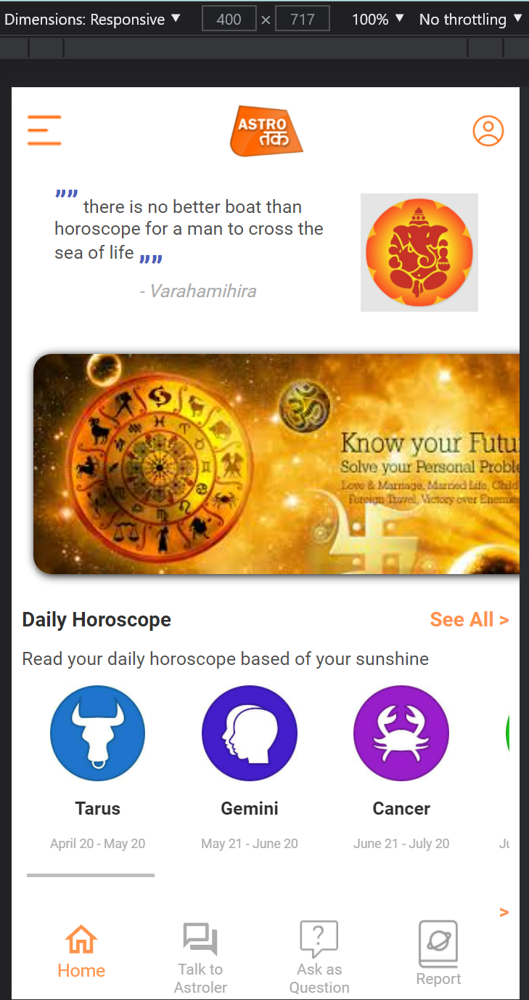

# Astrology Assignment

Front end of astrology assignment built using React.js, Material ui/icons and scss for styling.
Images and logos have been taken from internet acting as dummy data.
This project was bootstrapped with [Create React App](https://github.com/facebook/create-react-app).
Dummy data has been used in the Services (Replacable with rest APIs)

## Features
- Mobile view with attractive UI
- Home screen and astrologer screen
- Home screen contains various section fetching information from dummy data
    - Bottom navigation to switch between home and astrologer screen
- The data on the home screen is rendered from service methods
- On the Astrologer screen the user can view list of astrologers along with information
- Astrologer data can be filtered based on langauge
- Astrologer data can be sorted in the increasing/decreasing order of price and experience
- Astrologer can be searched based on name, speciality and language

Dummy data has been directly used in the services

## Preview
### Home Screen and Astrologer Screen
</img> </img>

## How To Install.

0. Run this app by directly opening the above link or follow steps below to set up on local directory.
1. Clone this project
2. Start by installing npm if you don't have it already.
3. Navigate to Project Directory by :
```
cd codial
```
4. run following commands :
```
npm install 
npm start or react-scripts start
```
## Directory Structure

`/src` - all code files <br>
`/src/components` - all react components <br>
`/src/routes` - all routes for react app <br>
`/src/services` - all services including method to fetch and modify data <br>
`/src/styles` - styles for all react components <br>
`/src/assets` - dummy images and logos <br>

## Available Scripts

In the project directory, you can run:

### `npm start`

Runs the app in the development mode.\
Open [http://localhost:3000](http://localhost:3000) to view it in the browser.

The page will reload if you make edits.\
You will also see any lint errors in the console.

### `npm test`

Launches the test runner in the interactive watch mode.\
See the section about [running tests](https://facebook.github.io/create-react-app/docs/running-tests) for more information.

### `npm run build`

Builds the app for production to the `build` folder.\
It correctly bundles React in production mode and optimizes the build for the best performance.

The build is minified and the filenames include the hashes.\
Your app is ready to be deployed!

See the section about [deployment](https://facebook.github.io/create-react-app/docs/deployment) for more information.
